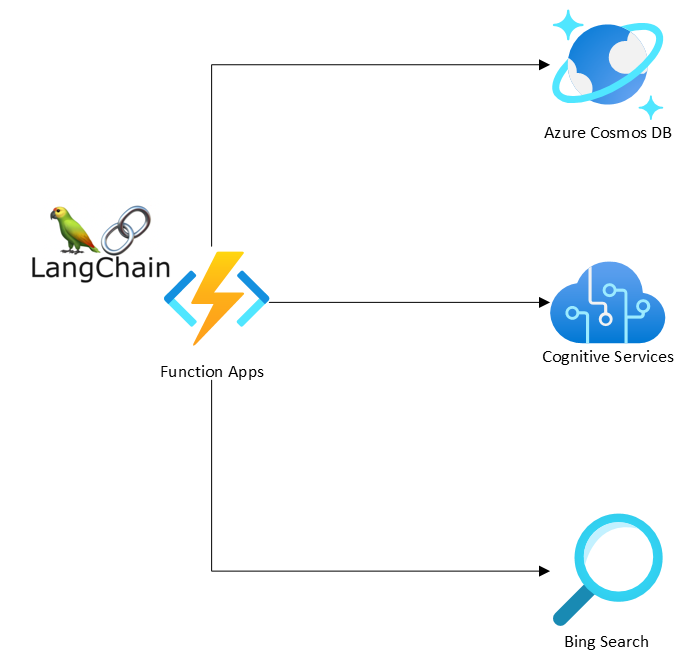
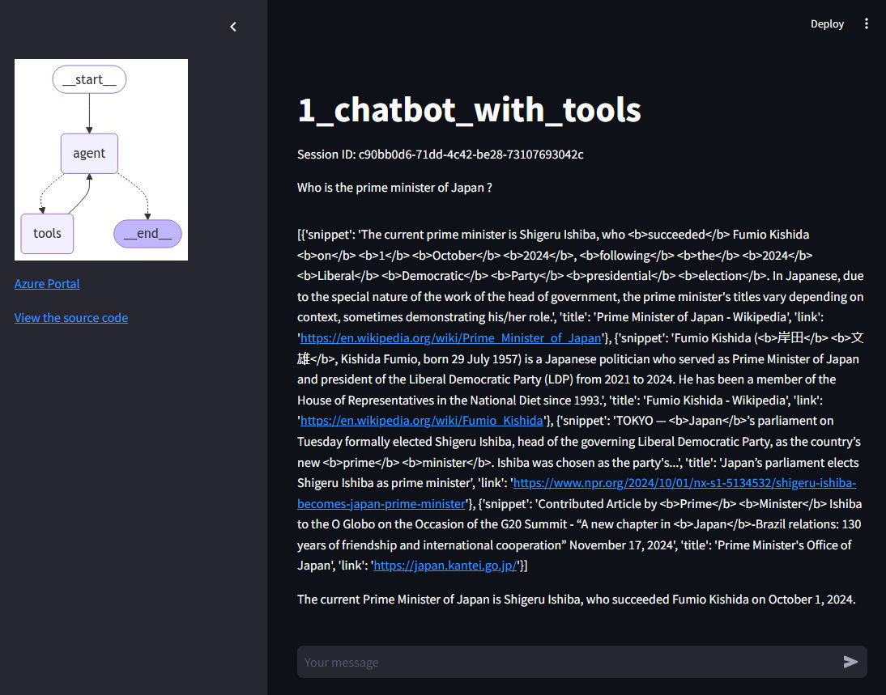
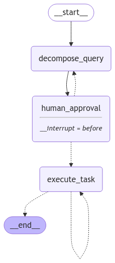
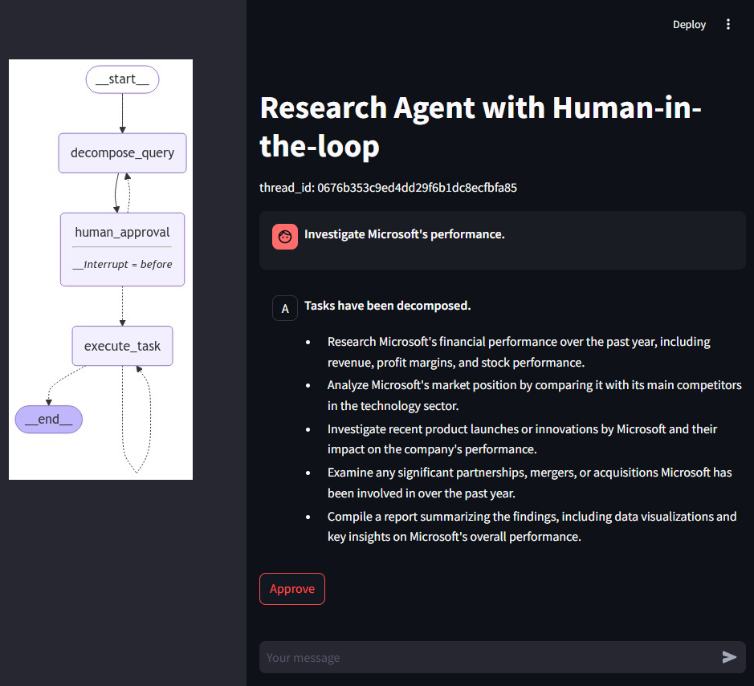
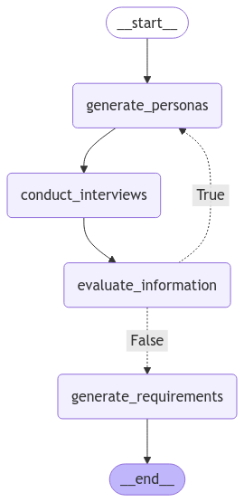
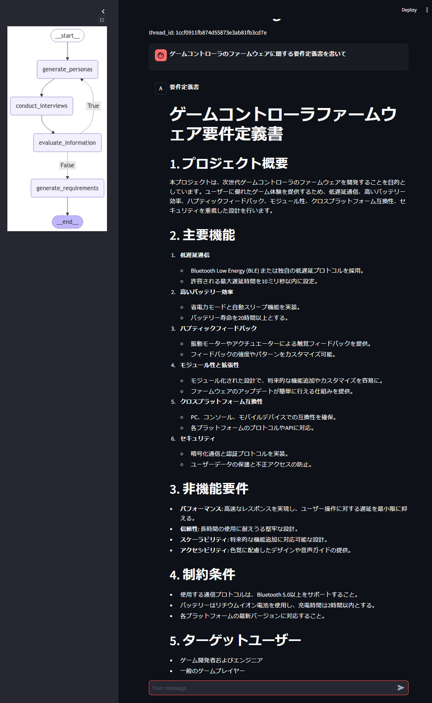
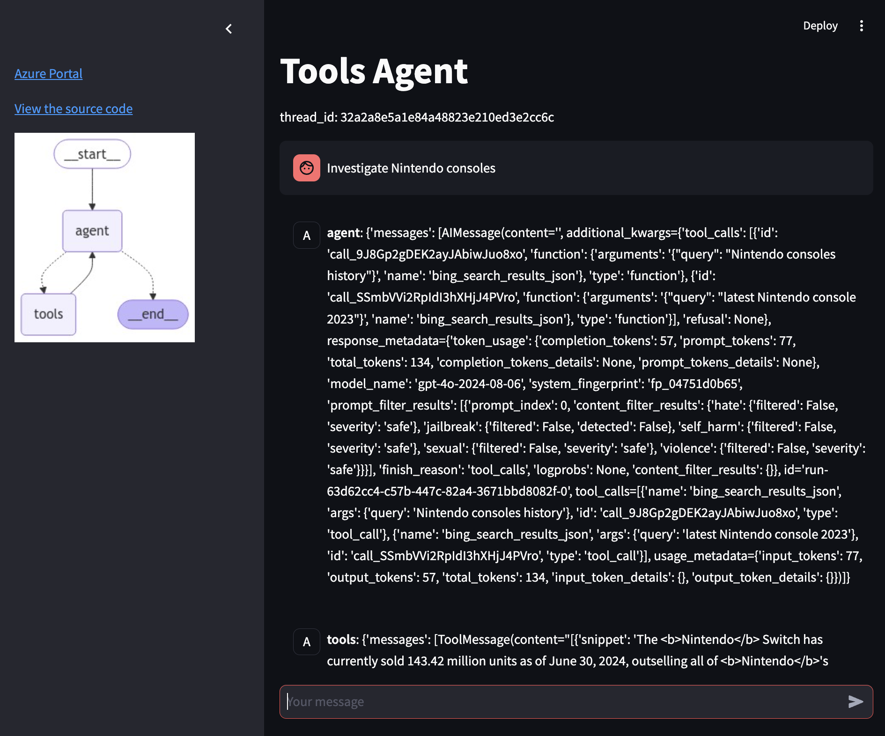
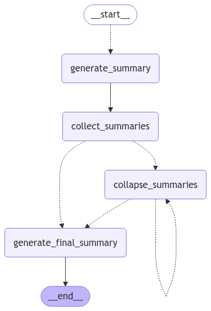

# Agents

## Overview

### Architecture



## How to run

### Local

Before running codes, you need to install the dependencies.

```shell
$ poetry install
```

To see some components are properly working, you can see the available commands as below.

```shell
$ poetry run python main.py --help
```

To run the Streamlit app, you can run the following commands.

```shell
$ poetry run streamlit run main.py streamlit-app
```

### Docker

```shell
# see the available commands
$ docker run --rm \
    -v ${PWD}/.env:/app/.env \
    ks6088ts/workshop-llm-agents:latest \
    python main.py --help

# mount the .env file to the container and expose the port 8501
$ docker run --rm \
    -v ${PWD}/.env:/app/.env \
    -p 8501:8501 \
    ks6088ts/workshop-llm-agents:latest
```

## Use cases

### Chatbot with Tools

Graph:


Screenshot:



#### References

- [🚀 LangGraph Quick Start > Part 2: 🛠️ Enhancing the Chatbot with Tools](https://langchain-ai.github.io/langgraph/tutorials/introduction/#part-2-enhancing-the-chatbot-with-tools)

### [Research Agent with Human-in-the-loop](https://github.com/mahm/softwaredesign-llm-application/tree/main/14)

Graph:



Screenshot:



YouTube: [Research Agent using Azure](https://youtu.be/7Tp_TvTpuw8)

#### References

- [Research Agent with Human-in-the-loop](https://github.com/mahm/softwaredesign-llm-application/tree/main/14)

### Documentation Agent

Graph:



Screenshot:



### Tools Agent

Graph:


Screenshot:



### Summarize Agent

Graph:



```shell
$ poetry run python main.py agents-summarize-run \
    --png ./docs/images/summarize_agent.png
```

#### References

- [How to summarize text through parallelization](https://python.langchain.com/docs/how_to/summarize_map_reduce/)
