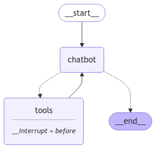

# How to use

## cosmosdbs.py

```shell
# help
poetry run python scripts/cosmosdbs.py --help

# insert data to Cosmos DB
poetry run python scripts/cosmosdbs.py insert-data \
    --pdf-url "https://www.maff.go.jp/j/wpaper/w_maff/r5/pdf/zentaiban_20.pdf"

# query data from Cosmos DB
poetry run python scripts/cosmosdbs.py query-data \
    --query "農林⽔産祭天皇杯受賞者"
```

### References

- [Azure Cosmos DB No SQL](https://python.langchain.com/docs/integrations/vectorstores/azure_cosmos_db_no_sql/)
- [Learn Azure Azure Cosmos DB Vector database](https://learn.microsoft.com/azure/cosmos-db/vector-database)
- [AzureDataRetrievalAugmentedGenerationSamples/Python/CosmosDB-NoSQL_VectorSearch](https://github.com/microsoft/AzureDataRetrievalAugmentedGenerationSamples/tree/main/Python/CosmosDB-NoSQL_VectorSearch)
- [Azure Cosmos DB ベクター検索機能と RAG の実装ガイド](https://note.com/generativeai_new/n/n3fcb2e57d195)
- [Azure CosmosDB for NoSQL でベクトル検索しよう！！](https://zenn.dev/nomhiro/articles/cosmos-nosql-vector-search)

## bing_searches.py

```shell
# help
poetry run python scripts/bing_searches.py --help

# search data from Bing
poetry run python scripts/bing_searches.py search \
    --query "Who is the CEO of Microsoft?"

# search data from Bing
poetry run python scripts/bing_searches.py chain \
    --query "Who is the CEO of Microsoft?"
```

### References

- [Bing Search](https://python.langchain.com/docs/integrations/tools/bing_search/)

## langgraphs.py



```shell
# help
poetry run python scripts/langgraphs.py --help

# draw a graph in mermaid format
poetry run python scripts/langgraphs.py draw-mermaid-png \
    --output docs/images/langgraphs_mermaid.png

# run a workflow implemented by LangGraph
poetry run python scripts/langgraphs.py run \
    --query "How is the weather today in Japan?"
poetry run python scripts/langgraphs.py run \
    --query "How is the weather today in San Francisco?"
```

### References

- [🦜🕸️LangGraph](https://langchain-ai.github.io/langgraph/)
- [🚀 LangGraph Quick Start](https://langchain-ai.github.io/langgraph/tutorials/introduction/)
